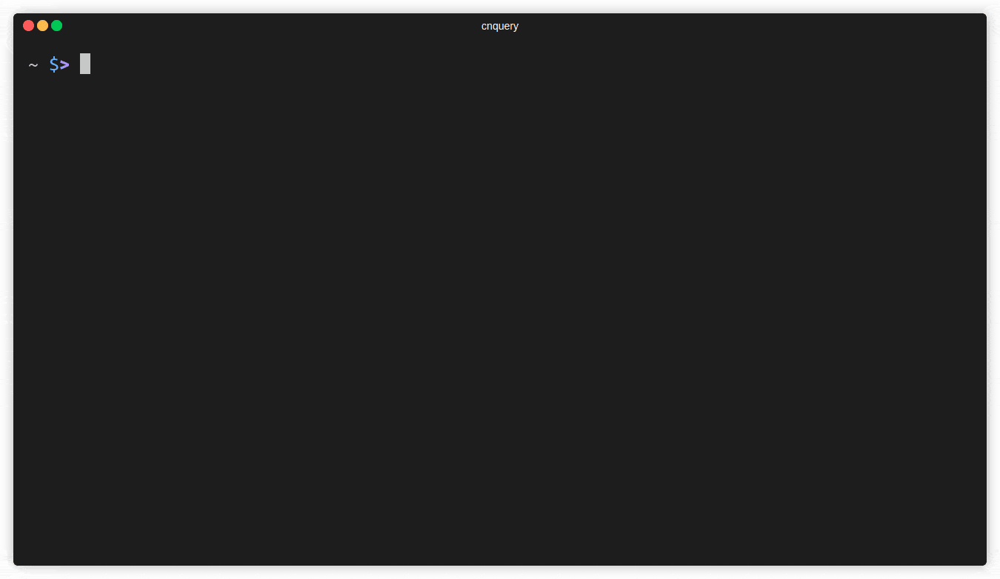

# cnquery

```
  ___ _ __   __ _ _   _  ___ _ __ _   _ 
 / __| '_ \ / _` | | | |/ _ \ '__| | | |
| (__| | | | (_| | |_| |  __/ |  | |_| |
 \___|_| |_|\__, |\__,_|\___|_|   \__, |
  mondoo™      |_|                |___/ 
```

**Open source, cloud-native asset inventory and discovery**

`cnquery` is a cloud-native tool for querying your entire fleet. It answers thousands of questions about your infrastructure, and integrates with over 300 resources across cloud accounts, Kubernetes, containers, services, VMs, APIs, and more.



Here are a few more examples:

```bash
# run a query and print the output
cnquery run -c "ports.listening { port process }"

# execute a query pack on a Docker image and print results as json
cnquery scan docker 14119a -f pack.mql.yaml -j

# open an interactive shell to an aws account
cnquery shell aws
> aws.ec2.instances{*}
```

## Installation

Install `cnquery` with our installation script:

**Linux and macOS**

```bash
bash -c "$(curl -sSL https://install.mondoo.com/sh/cnquery)"
```

**Windows**

```powershell
Set-ExecutionPolicy Unrestricted -Scope Process -Force;
[System.Net.ServicePointManager]::SecurityProtocol = [System.Net.ServicePointManager]::SecurityProtocol -bor 3072;
iex ((New-Object System.Net.WebClient).DownloadString('https://install.mondoo.com/ps1/cnquery')); 
Install-Mondoo -Product cnquery;
```

If you prefer a package, find it on [GitHub releases](https://github.com/mondoohq/cnquery/releases).

## Interactive shell

The easiest way to explore `cnquery` is to use our interactive shell, which has auto-complete to guide you:

```bash
cnquery shell
```

Once inside the shell, you can enter MQL queries like this:

```coffeescript
> asset { name title }
```

To learn more, use the `help` command. 

To exit, either press CTRL + D or type `exit`.

You can run the shell against local and remote targets, like `k8s`, `aws`, `docker`, and many more. Run `--help` to see a full list of supported providers.

## Run simple queries

To run standalone queries in your shell, use the `run` command:

```bash
cnquery run <TARGET> -c <QUERY>
```

For example, this runs a query against your local system:

```bash
cnquery run -c "services { name running }"
```

For automation, it is often helpful to convert the output to JSON. Use `-j` or `--json`:

```bash
cnquery run local -c "services { * }" -j
```

You can then pipe the output to [jq](https://stedolan.github.io/jq/) or other applications.

## Query packs

You can combine multiple queries into query packs, which can run together. `cnquery` comes with default [query packs](https://github.com/mondoohq/cnquery-packs) out of the box for most systems. You can simply run:

```bash
cnquery scan
```

Without specifying anything else, `cnquery` tries to find and run the default query pack for the given system.

You can specify a query pack that you want to run. Use the `--querypack` argument:

```bash
cnquery scan --querypack incident-response
```

You can also choose just one query from a query pack. Specify the query ID with the query pack:

```bash
cnquery scan --querypack incident-response --query-id sth-01
```

Custom query packs let you bundle queries to meet your specific needs. You can find a simple query pack example in `examples/simple.mql.yaml`. To run it:

```bash
cnquery scan -f examples/example-os.mql.yaml
```

Like all other commands, you can specify different providers like `k8s`, `aws`, `docker`, and many more. Run `--help` to see the full list of supported providers.


These files can also contain multiple query packs for many different target systems. For an example, see `examples/multi-target.mql.yaml`.

## Private Query Packs 

Distributing cnqueries across your fleet

You can share query packs across your fleet using the Mondoo's Query Hub. The Query Hub creates a secure, private environment in your account that stores data about your assets. It makes it very easy for all assets to report on query packs and define custom rules for your fleet.

To use the Query Hub:

```bash
cnquery login --token TOKEN
```

Once set up, activate the Pack's and you can collect your asset's data (for example `aws`):

```bash
cnquery scan aws
```

To add custom query packs, you can upload them:

```bash
cnquery bundle upload mypack.mql.yaml
```

## Supported Targets

| Description                  | Provider                   | Example                                                                                                                                                     |
| ---------------------------- | -------------------------- | ----------------------------------------------------------------------------------------------------------------------------------------------------------- |
| AWS accounts                 | `aws`                      | `cnquery shell aws`                                                                                                                                         |
| AWS EC2 instances            | `ssh`                      | `cnquery shell ssh user@host`                                                                                                                               |
| AWS EC2 Instance Connect     | `aws ec2 instance-connect` | `cnquery shell aws ec2 instance-connect ec2-user@INSTANCEID`                                                                                                |
| AWS EC2 EBS snapshot         | `aws ec2 ebs snapshot`     | `cnquery shell aws ec2 ebs snapshot SNAPSHOTID`                                                                                                             |
| AWS EC2 EBS volume           | `aws ec2 ebs volume`       | `cnquery shell aws ec2 ebs volume VOLUMEID`                                                                                                                 |
| Container images             | `container`, `docker`      | `cnquery shell container ubuntu:latest`                                                                                                                     |
| Container registries         | `container registry`       | `cnquery shell container registry index.docker.io/library/rockylinux:8 `                                                                                    |
| DNS records                  | `host`                     | `cnquery shell host mondoo.com`                                                                                                                             |
| GitHub organizations         | `github org`               | `cnquery shell github org mondoohq`                                                                                                                         |
| GitHub repositories          | `github repo`              | `cnquery shell github repo mondoohq/cnquery`                                                                                                                |
| GitLab groups                | `gitlab`                   | `cnquery shell gitlab --group mondoohq`                                                                                                                     |
| Google Cloud projects        | `gcp`                      | `cnquery shell gcp`                                                                                                                                         |
| Kubernetes cluster nodes     | `local`, `ssh`             | `cnquery shell ssh user@host`                                                                                                                               |
| Kubernetes clusters          | `k8s`                      | `cnquery shell k8s`                                                                                                                                         |
| Kubernetes manifests         | `k8s`                      | `cnquery shell k8s manifest.yaml `                                                                                                                          |
| Kubernetes workloads         | `k8s`                      | `cnquery shell k8s --discover pods,deployments`                                                                                                             |
| Linux hosts                  | `local`, `ssh`             | `cnquery shell local` or<br></br>`cnquery shell ssh user@host`                                                                                              |
| macOS hosts                  | `local`, `ssh`             | `cnquery shell local` or<br></br>`cnquery shell ssh user@IP_ADDRESS`                                                                                        |
| Microsoft 365 accounts       | `ms365`                    | `cnquery shell ms365 --tenant-id TENANT_ID --client-id CLIENT_ID --certificate-path PFX_FILE`                                                               |
| Microsoft Azure accounts     | `azure`                    | `cnquery shell azure --subscription SUBSCRIPTION_ID`                                                                                                        |
| Microsoft Azure instances    | `ssh`                      | `cnquery shell ssh user@host`                                                                                                                               |
| Running containers           | `docker`                   | `cnquery shell docker CONTAINER_ID`                                                                                                                         |
| SSL certificates on websites | `host`                     | `cnquery shell host mondoo.com`                                                                                                                             |
| Terraform HCL                | `terraform`                | `cnquery shell terraform HCL_FILE_OR_PATH`                                                                                                                  |
| Terraform plan               | `terraform plan`           | `cnquery shell terraform plan plan.json`                                                                                                                    |
| Terraform state              | `terraform state`          | `cnquery shell terraform state state.json`                                                                                                                  |
| Vagrant virtual machines     | `vagrant`                  | `cnquery shell vagrant HOST`                                                                                                                                |
| VMware vSphere               | `vsphere`                  | `cnquery shell vsphere user@domain@host --ask-pass`                                                                                                         |
| Windows hosts                | `local`, `ssh`, `winrm`    | `cnquery shell local`,<br></br>`cnquery shell ssh Administrator@IP_ADDRESS --ask-pass` or<br></br>`cnquery shell winrm Administrator@IP_ADDRESS --ask-pass` |


## What’s next?

There are so many things `cnquery` can do! Gather information about your fleet, find tool-sprawl across systems, run incident response, and share data with auditors… `cnquery` is nearly limitless in capabilities.

Explore:

- [cnspec docs](https://mondoo.com/docs/cnquery/)
- [Query Packs](https://github.com/mondoohq/cnquery-packs)
- [MQL introduction](https://mondoohq.github.io/mql-intro/index.html)
- [MQL Language Reference](https://mondoo.com/docs/mql/resources/)
- [cnspec](https://github.com/mondoohq/cnspec), our open source, cloud-native security scanner

## Join the community!

Our goal is to become the API for your entire infrastructure. Join our [community](https://github.com/orgs/mondoohq/discussions) today and let’s grow it together!

## Development

See our [Development Documentation](docs/development.md) for information on building and contributing to cnquery.

## Legal

- **Copyright:** 2018-2022, Mondoo Inc
- **License:** MPLv2
- **Authors:** Christoph Hartmann, Dominik Richter
